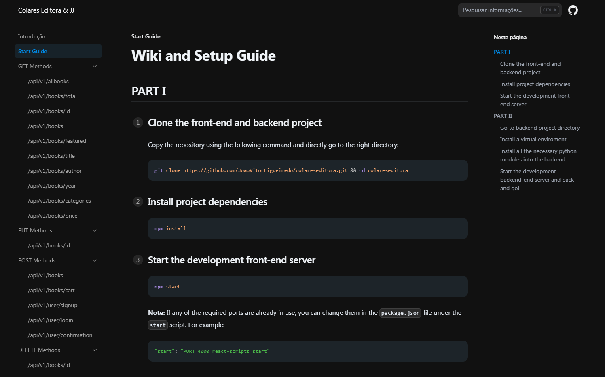

import { Callout, Cards } from 'nextra/components'

# **Basic Book Shop with React and Flask!**

This project was mainly inspired by our College course and can be used to inspire more students in their learning process too! We used several programming languages (Python and JavaScript) and also a bit of HTML and CSS.

## Quick Start

<Callout type="info">
  You can check our Github V2 project in [Colares Editora](https://github.com/JoaoVitorFigueiredo/colareseditora/blob/v2) or follow our guide bellow.
</Callout>

<Cards num={1}>
  <Cards.Card
    image
    arrow
    title="Start guide"
    href="/setup"
  >
    <></>
  </Cards.Card>
</Cards>

Developers can check how to use and how our REST API works by checking our methods and endpoints.

## License

This project is licensed under the MIT License - check the [LICENSE.md](https://github.com/JoaoVitorFigueiredo/colareseditora/blob/v2/LICENSE) file for details.

## Acknowledgements

Core concept of front-end inspired by [react-app](https://github.com/facebook/create-react-app).
Template of documentation used [nextra-docs](https://nextra.site/docs/docs-theme/start).

This project was made by João Ferreira and João Figueiredo for educational purposes only and we expect you use this for the same purpose.

---

We hope you enjoy using our Book Shop Project and cool endpoints. 

If you have any questions or issues, feel free to ask.

**Safe Shopping!** 💸