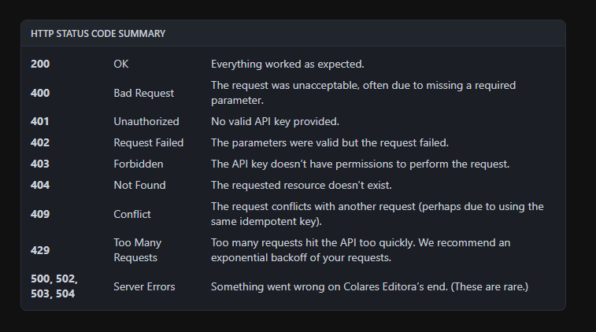

import { Callout } from 'nextra/components';
import { Cards, Card } from 'nextra/components';

# Errors & Status Codes

Colares Editora uses conventional HTTP response codes to indicate the success or failure of an API request. In general: Codes in the 2xx range indicate success. Codes in the 4xx range indicate an error that failed given the information provided (e.g., a required parameter was omitted, a request failed, etc.). Codes in the 5xx range indicate an error with Colares Editora's servers (these are rare).

Some 4xx errors that could be handled programmatically (e.g., a auth with invalid credentials) include an error code that briefly explains the error reported.

